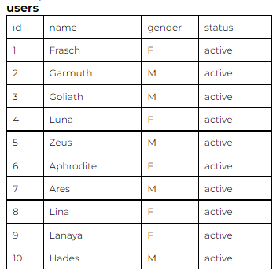
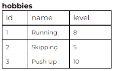
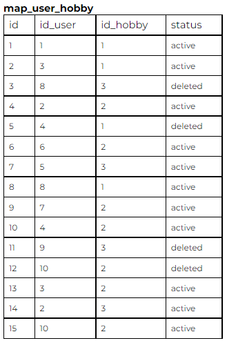
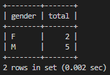
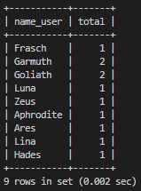
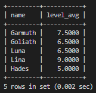

# CODING TEST BACKEND DEVELOPER

## TEST LOGIKA

1. Soal Pertama

   Buat fungsi dengan menampilkan bilangan cacah kelipatan 3 atau 7 sebanyak N, serta menampilkan huruf Z saat bilangan tersebut kelipatan 3 dan 7.

   Contoh : <br>
   N = 13 <br>
   Output : 3, 6, 7, 9, 12, 14, 15, 18, Z, 24, 27, 28, 30

   > Jawabannya

   ```javascript
   let kelipatan = (n) => {
     let temp = [];
     for (let i = 1; temp.length < n; i++) {
       if (i % 3 == 0 && i % 7 == 0) {
         temp.push("Z");
       } else if (i % 3 == 0 || i % 7 == 0) {
         temp.push(i);
       }
     }
     console.log(temp);
   };

   kelipatan(13);
   ```

   > Hasilnya

   ```json
   [3, 6, 7, 9, 12, 14, 15, 18, "Z", 24, 27, 28, 30]
   ```

2. Soal Kedua

   Buat fungsi pencarian ‘sang gajah’, ‘serigala’, ‘harimau’. Dengan contoh masukan dan keluaran sebagai berikut :

   **Input**: Berikut adalah kisah sang gajah. Sang gajah memiliki teman serigala bernama DoeSang. Gajah sering dibela oleh serigala ketika harimau mendekati gajah.

   **Output**: sang gajah - sang gajah - serigala - serigala - harimau

   > Jawabannya

   ```javascript
   function pencarian(data) {
     let input =
       "Berikut adalah kisah sang gajah. Sang gajah sering dibela oleh serigala ketika harimau mendekati gajah.".toLowerCase();

     let result = "";

     for (let j = 0; j < data.length; j++) {
       let tempInput = input;
       for (let i = 0; i < input.length; i++) {
         let cari = tempInput.indexOf(data[j].toLowerCase());
         if (cari > 1) {
           result += result === "" ? data[j] : " - " + data[j];
           tempInput = tempInput.substring(cari + 1, input.length);
         } else {
           i = input.length;
         }
       }
     }

     return result;
   }

   console.log(pencarian(["sang gajah", "serigala", "harimau"]));
   ```

   > Hasilnya

   ```json
   sang gajah - sang gajah - serigala - harimau
   ```

3. Soal Ketiga

   Buatlah fungsi pengecekan kata sandi, dengan ketentuan sebagai:

   - Kata sandi minimal 8 karakter
   - Kata sandi maksimal 32 karakter
   - Karakter awal tidak boleh angka
   - Harus memiliki angka
   - Harus memiliki huruf kapital dan huruf kecil

   <br>

   Contoh:

   Input : 5andiwara <br>
   Output : Karakter awal tidak boleh angka <br>

   Input : sandiwar4 <br>
   Output : Harus memiliki huruf kapital dan huruf kecil <br>

   Input : Sandiwar4 <br>
   Output : Kata sandi valid <br>

   > Jawabannya

   ```javascript
   function validate(pass) {
     let text = pass.split("").filter((el) => isNaN(+el));

     if (pass.length < 8) {
       return "Kata sandi minimal 8 karakter";
     } else if (pass.length > 32) {
       return "Kata sandi maximal 32 karakter";
     } else if (!isNaN(+pass[0])) {
       return "Karakter awal tidak boleh angka";
     } else if (!pass.split("").find((el) => !isNaN(+el))) {
       return "Harus memiliki angka";
     } else if (
       !(
         text.find((el) => el == el.toLowerCase()) &&
         text.find((el) => el == el.toUpperCase())
       )
     ) {
       return "Harus memiliki huruf kapital dan huruf kecil";
     } else {
       return "Kata sandi valid";
     }
   }

   console.log(validate("5andiwara"));
   console.log(validate("sandiwar4"));
   console.log(validate("Sandiwar4"));
   ```

   > Hasilnya

   ```json
   Karakter awal tidak boleh angka
   Harus memiliki huruf kapital dan huruf kecil
   Kata sandi valid
   ```

4. Soal Keempat

   Buat fungsi pengecekan bilangan cacah terkecil yang tidak ada dari data yang diinputkan. Dengan contoh input dan output sebagai berikut :

   <table>
     <tbody>
       <tr>
         <th>Contoh 1</th>
         <th>Contoh 2</th>
         <th>Contoh 3</th>
       <tr>
       <tr>
         <td>
           Input : [5, 2, 8, 4, 3, 10] <br>
           Output : 6
         </td>
         <td>
           Input : [2, 3, 4, 6] <br>
           Output : 5
         </td>
         <td>
           Input : [8, 6, 7, 12] <br>
           Output : 9
         </td>
       </tr>
     </tbody>
   </table>

   ```javascript
   function cacahTerkecil(bil) {
     let bilSort = bubbleSort(bil);
     let id = bilSort[0];
     for (let i = 0; i < bil.length; i++) {
       if (bilSort[i] !== id) return id;
       id++;
     }
   }

   function bubbleSort(items) {
     let length = items.length;
     for (let i = 0; i < length; i++) {
       for (let j = 0; j < length - i - 1; j++) {
         if (items[j] > items[j + 1]) {
           let temp = items[j];
           items[j] = items[j + 1];
           items[j + 1] = temp;
         }
       }
     }
     return items;
   }

   console.log(cacahTerkecil([5, 2, 8, 4, 3, 10]));
   console.log(cacahTerkecil([2, 3, 4, 6]));
   console.log(cacahTerkecil([8, 6, 7, 12]));
   ```

   > Hasilnya

   ```json
   6
   5
   9
   ```

5. Soal Kelima

   Buat pola berikut sesuai inputan N, dengan N adalah bilangan ganjil

   \*catatan : nilai lebih jika pakai rekursif
   <table>
     <tbody>
       <tr>
         <th>Input</th>
         <th>N = 5</th>
         <th>N = 3</th>
         <th>N = 7</th>
         <th>N = 2</th>
       <tr>
       <tr>
         <td>
           Output
         </td>
         <td>
           XXXXX <br>
           XOOXX <br>
           XOXOX <br>
           XXOOX <br>
           XXXXX <br>
         </td>
         <td>
           XXX <br>
           XXX <br>
           XXX <br>
         </td>
         <td>
           XXXXXXX <br>
           XOOOOXX <br>
           XOOOXOX <br>
           XOOXOOX <br>
           XOXOOOX <br>
           XXOOOOX <br>
           XXXXXXX <br>
         </td>
         <td>
           Harus bilangan ganjil
         </td>
       </tr>
     </tbody>
   </table>

   ```javascript
   function pola(n) {
     if (n % 2 == 0) return "Harus bilangan ganjil";

     let result = "";
     for (let i = 0; i < n; i++) {
       let text = "";
       for (let j = 0; j < n; j++) {
         if (i > 0 && i < n - 1 && j > 0 && j < n - 1)
           if (n - 1 - i > j || n - 1 - i < j) text += "O ";
           else text += "X ";
         else text += "X ";
       }
       result += text + "\n";
     }
     return result;
   }

   console.log(pola(5));
   console.log(pola(3));
   console.log(pola(7));
   console.log(pola(2));
   ```

   > Hasilnya

   ```json
    X X X X X
    X O O X X
    X O X O X
    X X O O X
    X X X X X

    X X X
    X X X
    X X X

    X X X X X X X
    X O O O O X X
    X O O O X O X
    X O O X O O X
    X O X O O O X
    X X O O O O X
    X X X X X X X

    Harus bilangan ganjil
   ```

<br>

---

<br>

## TEST BACKEND (MySQL Query)

Terdapat 3 Tabel berikut:





1. Buat query untuk membuat tabel di atas dengan indexing.

   > Jawabannya

   ```sql
    CREATE INDEX data_users_idx ON users(id);
    CREATE INDEX data_hobbies_idx ON hobbies(id);
    CREATE INDEX data_map_user_hobby_idx ON map_user_hobby(id);
   ```

   > Hasilnya

   ```json
   [3, 6, 7, 9, 12, 14, 15, 18, "Z", 24, 27, 28, 30]
   ```

2. Buat query untuk menghitung jumlah user masing masing gender pada suatu hobby tertentu.

   - Input / filter : skipping
   - Output:
       <table>
         <tr>
           <th>Gender</th>
           <th>Total</th>
         </tr>
         <tr>
           <td>M</td>
           <td>5</td>
         </tr>
         <tr>
           <td>F</td>
           <td>1</td>
         </tr>
       </table>

   > Jawabannya

   ```sql
   SELECT u.gender as gender, count(gender) as total  FROM users u LEFT JOIN map_user_hobby m ON m.id_user = u.id LEFT JOIN hobbies h ON m.id_hobby  =  h.id  WHERE h.name = 'Skipping' GROUP BY u.gender;
   ```

   > Hasilnya

   

3. Buat query untuk menghitung jumlah hobby dari setiap user yang masih aktif

   - Output kolom: name_user, total

   <br>

   > Jawabannya

   ```sql
   SELECT u.name as name_user, count(m.id_user) as total FROM users u LEFT JOIN map_user_hobby m ON m.id_user = u.id WHERE m.status = 'active' GROUP BY m.id_user;
   ```

   > Hasilnya

   

4. Hitung level rata - rata tiap user dari hobi yang dimiliki, ketika user memiliki hobi lebih dari 1

   - Output kolom: name, level_avg

   <br>

   > Jawabannya

   ```sql
   SELECT u.name as name, (sum(h.level) / count(m.id_user)) as level_avg FROM users u LEFT JOIN map_user_hobby m ON m.id_user = u.id LEFT JOIN hobbies h ON h.id = m.id_hobby GROUP BY m.id_user HAVING count(m.id_user) > 1;
   ```

   > Hasilnya

   
